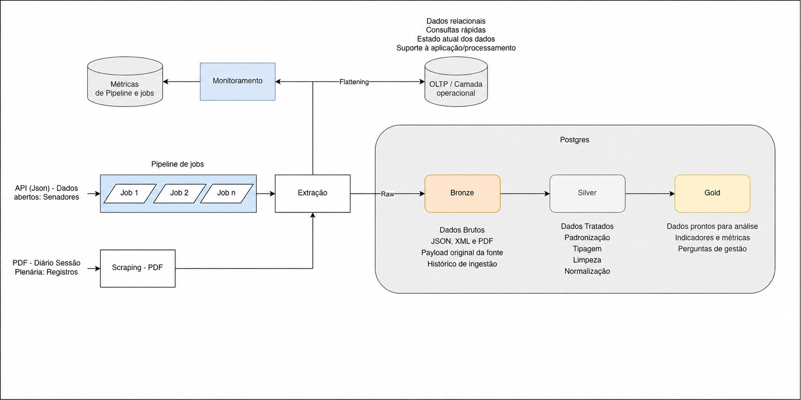

# Arquitetura do pipeline

O Mandato Aberto executa um pipeline de dados em lote que coleta informações públicas do Senado Federal,
preserva as respostas originais e mantém uma fonte transacional normalizada em PostgreSQL. A
arquitetura prioriza reprocessamento seguro, rastreabilidade da origem e separação entre dado bruto,
dado operacional e metadados de execução.



## Fluxo de uma execução

Uma carga é iniciada por `make ingestion` e segue este ciclo:

1. O Docker Compose inicia o PostgreSQL e aguarda o `healthcheck` do serviço.
2. O contêiner de ingestão abre uma conexão transacional e cria um `run_id` em
   `monitoring.pipeline_runs`.
3. O cliente HTTP consulta as fontes oficiais com timeout, repetição e backoff para erros
   transitórios.
4. Cada resposta válida é gravada em `bronze.raw_payloads` antes da transformação. JSON é salvo em
   `JSONB`; documentos do DSF são salvos em `BYTEA`.
5. O job interpreta a resposta, normaliza valores, resolve chaves e aplica as regras do domínio.
6. Os registros são carregados no schema `oltp` com operações de upsert e restrições de banco.
7. O pipeline registra duração e estado de cada job. Ao final, marca a execução como `success` ou
   `failed` e publica um resumo nos logs.

O processamento é sequencial. Essa escolha simplifica dependências: senadores precisam existir
antes das participações em comissões, das despesas, da presença e da estrutura de gabinete.

## Jobs e dependências

| Ordem | Job | Entrada principal | Saída operacional |
|---:|---|---|---|
| 1 | `senators` | cadastro parlamentar da API legislativa | senadores e identificadores usados pelos jobs seguintes |
| 2 | `committees` | comissões de cada senador | comissões e participações por período |
| 3 | `dsf_attendance` | páginas do Diário do Senado Federal | sessões, documentos de evidência e registros de presença |
| 4 | `expenses` | CEAPS do ano configurado | fornecedores e despesas |
| 5 | `staff` | recursos utilizados por senador e ano | quantitativos e benefícios da estrutura de gabinete |

O orquestrador ainda contém o job legado `sessions`, baseado em ocorrências de votação. Ele não é
fonte válida para medir assiduidade e não integra o contrato-alvo de presença. A fonte oficial para
esse domínio é o DSF, conforme detalhado em [Presença via DSF](./metrics/presenca-dsf.mdx).

## Persistência

### Bronze

`bronze.raw_payloads` é a zona de aterrissagem mínima. Cada objeto armazena:

- origem, URL e tipo de entidade;
- conteúdo original em JSONB ou binário;
- tipo de mídia e código HTTP;
- ano de ingestão, quando aplicável;
- execução que observou o conteúdo pela primeira e pela última vez;
- hash SHA-256 calculado sobre uma representação canônica do conteúdo.

A chave única `(source_url, content_sha256)` impede que uma resposta idêntica seja duplicada em
reprocessamentos. Uma mudança real no conteúdo produz outro hash e preserva uma nova versão bruta.
Essa camada permite auditoria e reprocessamento, mas ainda não é um data lake: não há armazenamento
de objetos, formato colunar, política de retenção ou catálogo externo.

### OLTP

O schema `oltp` mantém a visão operacional normalizada. As tabelas se agrupam em cinco domínios:

| Domínio | Entidades principais |
|---|---|
| Parlamentar | `senadores`, `mandatos`, `exercicios_mandato`, `filiacoes_partidarias` |
| Comissões | `comissoes`, `participacoes_comissao` |
| Presença | `sessao_plenaria`, `documento_dsf`, `registro_presenca`, `licenca_justificativa` |
| CEAPS | `fornecedores`, `despesas` |
| Gabinete | `estrutura_gabinete` |

Chaves primárias e estrangeiras protegem os relacionamentos; restrições `CHECK` barram valores fora
do domínio; restrições `UNIQUE` definem a identidade de reprocessamento; e índices apoiam os
recortes por parlamentar, período, fornecedor e tipo de despesa. Os upserts convergem para o mesmo
estado quando a fonte não mudou.

O OLTP não deve ser chamado de Silver. Ele espelha e organiza o sistema de origem para sustentar a
ingestão e as consultas da E1. Uma camada Silver precisará de contrato analítico próprio, tratamento
temporal e regras explícitas para correções retroativas.

### Monitoring

O schema `monitoring` separa metadados técnicos dos dados de negócio:

- `pipeline_runs` registra início, fim, duração, ano, status e mensagem de erro da carga completa;
- `job_runs` registra a mesma trajetória por job e reserva contadores de registros lidos, gravados,
  ignorados e rejeitados;
- os logs do contêiner complementam essas tabelas com progresso e contexto operacional.

O `run_id` também acompanha os objetos da Bronze. Assim, uma resposta preservada pode ser ligada à
execução que a coletou. No estado atual, ainda não existem alertas, painel de observabilidade ou
acordo formal de nível de serviço.

## Confiabilidade e idempotência

O pipeline combina controles em diferentes pontos:

- o PostgreSQL só é acessado depois de ficar saudável;
- o cliente HTTP repete respostas `429`, `500`, `502`, `503` e `504`, com backoff;
- cada requisição possui timeout, evitando espera indefinida;
- o bruto é identificado por URL e hash de conteúdo;
- a carga operacional usa chaves oficiais ou chaves documentais estáveis;
- cada lote é confirmado por transação; uma exceção provoca rollback do trabalho ainda não
  confirmado;
- falhas fatais marcam o job e o pipeline como `failed` e encerram o processo com código diferente
  de zero;
- testes verificam integridade referencial, unicidade, volumes mínimos, qualidade da presença e
  separação entre comparecimento e voto.

Alguns jobs iteram por senador e registram a falha individual sem interromper toda a carga. Esse
comportamento aumenta a disponibilidade, mas exige atenção: até que os contadores de rejeição sejam
alimentados por todos os jobs, uma execução tecnicamente concluída pode conter cobertura parcial.

## Configuração e operação

| Variável | Finalidade | Padrão |
|---|---|---|
| `INGESTION_YEAR` | ano consultado em CEAPS e estrutura de gabinete | `2024` |
| `LIMIT_SENADORES` | limita o volume durante desenvolvimento; `0` processa todos | `0` |
| `LEGISLATURE` | legislatura usada nas cargas históricas | `57` |
| `POSTGRES_DB` | nome do banco | `inflow_db` |
| `POSTGRES_USER` | usuário do banco | `inflow_user` |
| `POSTGRES_PORT` | porta publicada no host | `5433` |

Os valores de conexão usados dentro da rede Docker são injetados no contêiner de ingestão. Senhas
devem permanecer no arquivo `.env`, que não deve ser versionado.

Comandos principais:

```bash
make ingestion  # inicia o banco e executa uma carga
make test       # executa a carga e a suíte de qualidade
make logs       # acompanha os logs dos serviços
make db-shell   # abre o psql no banco do projeto
```

## Organização do código

```text
ingestion/src/
├── bronze/       # persistência do conteúdo bruto
├── clients/      # sessão HTTP, TLS e política de repetição
├── database/     # conexão e espera pelo PostgreSQL
├── jobs/         # extração e carga por domínio
├── monitoring/   # métricas e resumo das execuções
├── config.py     # parâmetros obtidos do ambiente
├── domain.py     # normalizações e regras compartilhadas
└── main.py       # ordem e tratamento global da execução
```

As definições de banco ficam em `scripts/sql/`, separadas pelos schemas `bronze`, `oltp` e
`monitoring`. A justificativa do modelo e de seus compromissos está no
[Registro de ADR](./adr/modelagem-do-sistema-de-origem); fontes e contratos de dados estão
em [Fontes e endpoints](./fontes-e-endpoints); e as medições estão registradas em
[Carga de trabalho](./metrics/workload).
